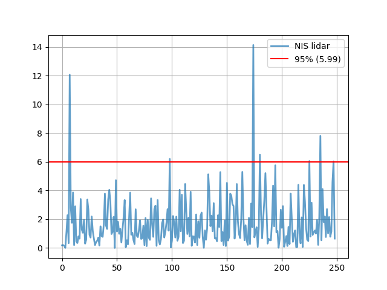
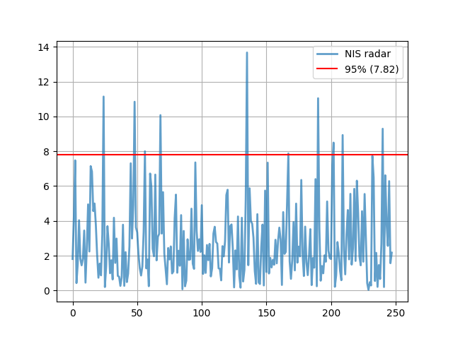
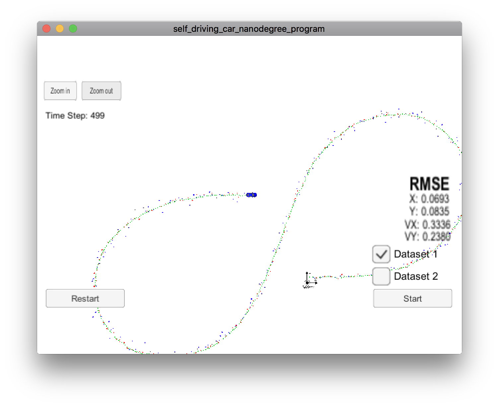
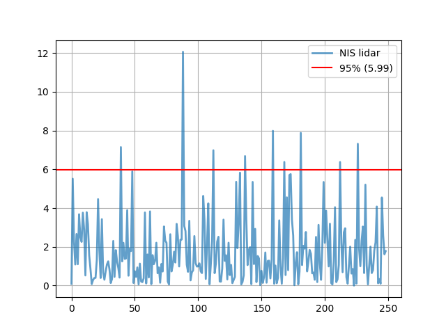
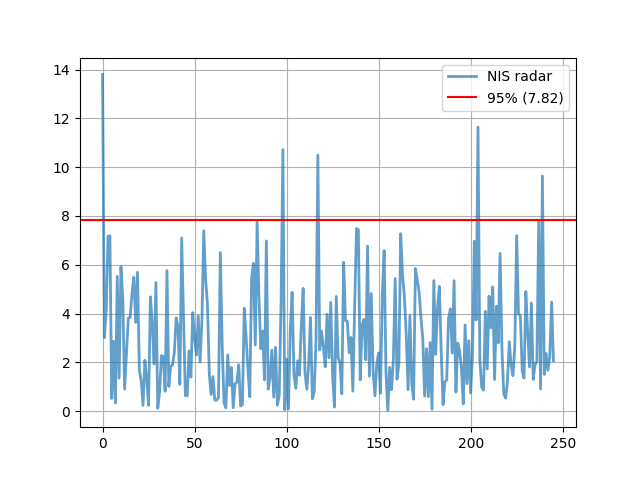
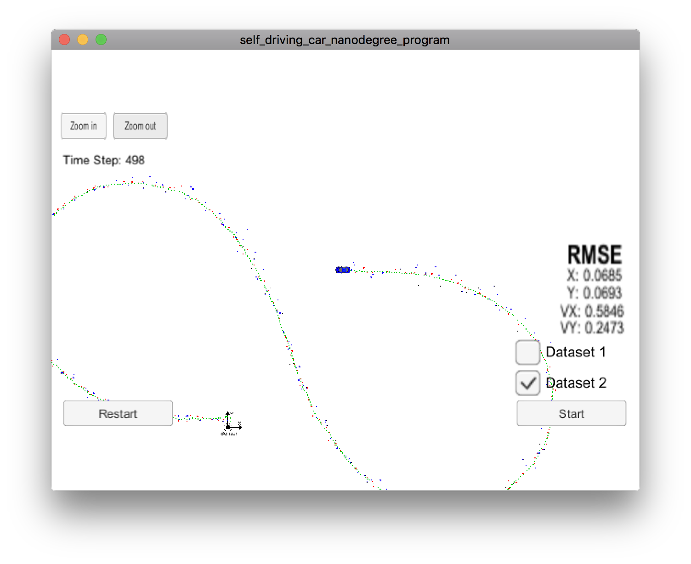

# Unscented Kalman Filter Project Starter Code

This is the output report. I've tried to use NIS graphs to better understand and tune my parameters. 

## Dataset 1

NIS values for the charts. Please note that the first NIS value for
the radar is ignored, the chart would have been difficult to interpret.

```
LIDAR
[0.184602, 0.200567, 0.160854, 0.00431654, 1.06915, 2.28812, 0.325776, 12.0697, 2.79955, 1.75268, 3.86877, 0.195341, 2.89962, 0.44324, 0.339875, 0.813515, 0.645633, 3.40818, 1.27105, 1.05361, 1.96995, 0.298606, 0.572989, 3.38116, 2.66726, 0.912788, 0.723993, 2.20003, 1.16142, 0.653937, 0.200082, 0.404818, 0.504796, 0.718748, 0.174882, 1.50098, 0.827678, 0.77346, 1.64863, 3.79053, 1.56567, 1.32592, 3.37654, 4.04859, 3.21825, 0.968677, 1.11948, 2.16863, 3.70848e-05, 4.71962, 1.14576, 1.81542, 0.987777, 1.33972, 0.389254, 1.24654, 2.12635, 3.34218, 0.0468709, 0.533518, 0.25751, 2.02499, 3.85431, 0.92186, 1.0517, 0.547843, 0.276577, 2.69457, 0.84846, 0.752556, 1.26506, 1.9282, 0.625448, 0.682064, 1.5572, 0.190236, 2.09592, 0.124467, 1.96045, 0.707559, 0.562756, 3.45782, 1.58884, 0.773161, 2.7075, 2.94705, 0.147926, 3.34171, 0.521872, 0.242317, 0.612325, 1.72468, 1.98569, 0.723674, 1.10881, 1.75298, 2.70659, 1.20601, 6.20288, 0.0391873, 0.516513, 2.22297, 1.79084, 0.723068, 2.19175, 0.502848, 0.774591, 4.05319, 1.16439, 3.70929, 0.337793, 0.50533, 4.46068, 2.65113, 0.969364, 2.10244, 0.811758, 3.917, 0.150536, 0.816044, 0.79424, 0.382353, 2.33381, 0.2009, 1.85705, 0.710484, 2.24286, 2.46217, 0.745369, 0.00617421, 1.22528, 0.576213, 1.36235, 5.12887, 3.86762, 1.5209, 2.25008, 1.16548, 3.12096, 0.671105, 0.685874, 0.464195, 2.29175, 1.45817, 5.2862, 0.474521, 1.11183, 0.198749, 1.9165, 0.135493, 4.53636, 0.516921, 0.764958, 3.7882, 3.64149, 3.05032, 2.92451, 0.652303, 1.70348, 4.4583, 1.83846, 0.963564, 0.68724, 2.03383, 5.30099, 2.11927, 0.531297, 1.58545, 0.49448, 0.213316, 2.09972, 0.274155, 3.0966, 1.45111, 14.1453, 0.734474, 1.1428, 1.44686, 0.0699629, 1.39266, 6.49826, 2.35197, 0.665653, 1.9956, 3.33005, 5.21491, 2.78928, 0.302617, 0.632975, 0.536868, 0.528374, 1.86308, 4.34938, 1.49975, 5.75859, 1.08657, 1.1806, 0.0116156, 0.623603, 2.66342, 1.40097, 2.90928, 0.0829463, 0.421834, 0.83124, 0.13464, 1.4687, 0.270632, 3.79752, 2.04246, 0.426405, 0.943535, 1.22375, 0.0589665, 0.0749666, 4.39696, 0.995971, 0.31579, 2.12734, 0.0710116, 4.39125, 3.21048, 1.40367, 0.572676, 0.483263, 6.05848, 0.79867, 3.15827, 0.911238, 1.07192, 1.22322, 1.00537, 1.96333, 0.208965, 2.17109, 7.80871, 0.529626, 4.108, 1.79839, 2.20048, 0.758836, 2.70882, 1.01525, 2.15503, 0.782905, 1.14579, 4.59732, 6.03413, 0.649188]
RADAR
[74.1733, 1.80995, 4.21898, 7.47752, 0.425602, 1.53383, 4.0362, 1.81294, 1.44687, 1.83815, 3.44506, 0.451971, 2.43453, 4.94739, 2.24125, 7.14398, 6.83007, 4.56208, 4.99715, 3.77288, 2.04403, 0.733935, 1.54599, 0.869949, 3.23078, 11.14, 0.200178, 1.39757, 3.6954, 2.65642, 0.990416, 1.73685, 0.635134, 4.1786, 1.58524, 2.98362, 0.838936, 0.791183, 0.265813, 0.752644, 3.77832, 0.26822, 2.20446, 0.483438, 0.972671, 2.54541, 7.3069, 2.98733, 4.9064, 10.8424, 3.62752, 3.34288, 2.0916, 1.2885, 0.8619, 1.38581, 3.37306, 7.99623, 1.27336, 1.7803, 0.246726, 6.71908, 5.96422, 2.40071, 1.96709, 6.65813, 1.73231, 3.08392, 3.25517, 10.074, 3.27007, 5.64876, 2.11013, 1.22735, 0.357817, 2.44214, 1.78473, 2.53161, 0.980344, 1.09378, 4.16205, 5.50604, 1.02107, 2.28338, 1.42287, 4.33025, 0.0729603, 3.42046, 0.242769, 0.563491, 2.94197, 1.76192, 1.78723, 4.70026, 1.53691, 1.24353, 7.35642, 3.42817, 2.27351, 2.94307, 2.21489, 4.90223, 0.952288, 2.02088, 1.0111, 2.61358, 1.74435, 2.6771, 0.808169, 1.28344, 3.2684, 3.66148, 2.78891, 2.69391, 1.27271, 1.2493, 0.581245, 2.54825, 1.95964, 2.83617, 5.48487, 5.78609, 1.60909, 3.6971, 3.79612, 2.40723, 0.177722, 2.29961, 1.21178, 4.25254, 0.843686, 0.162709, 4.1786, 0.517538, 1.18126, 5.23074, 13.6693, 1.45445, 5.87053, 3.98769, 3.83637, 3.02835, 1.12511, 0.381896, 4.38574, 0.4706, 0.373201, 2.49145, 3.7859, 0.289997, 5.73906, 1.06374, 7.34292, 0.976065, 1.87383, 1.32371, 1.7622, 1.47871, 2.9127, 1.55866, 2.83185, 3.61288, 2.92754, 0.318098, 4.50319, 2.10448, 2.21843, 5.05018, 7.87264, 1.67777, 0.669886, 1.74181, 3.92978, 1.15556, 4.99084, 1.60028, 2.52151, 1.96178, 6.34959, 2.0791, 0.83262, 3.66974, 1.61367, 0.882486, 2.01368, 3.52309, 0.312128, 1.86219, 1.30962, 6.39778, 0.244593, 11.0435, 3.57051, 0.563434, 1.40525, 0.987937, 2.02056, 1.6551, 5.11358, 2.2858, 1.8655, 1.80591, 7.19983, 8.49445, 0.211786, 0.86937, 2.78276, 2.14784, 1.13153, 0.590793, 8.93004, 2.30234, 0.927044, 3.22633, 4.62107, 1.78829, 5.55059, 1.48605, 2.42709, 5.83984, 1.69809, 6.30772, 4.44099, 1.95745, 1.44751, 4.55636, 1.65562, 5.54388, 2.96487, 0.425794, 0.0372427, 0.473551, 0.288454, 7.73167, 6.48829, 0.546184, 2.16163, 0.208303, 1.46021, 0.662135, 2.68673, 9.29135, 0.19974, 6.61912, 3.87909, 2.56304, 6.28157, 1.56765, 2.1727]
```

#### Data plots





#### Final result

Here you may visualize the final values for the experiment




## Dataset 2

NIS values for the charts. Please note that the first two NIS value for
the radar are ignored, the chart would have been difficult to interpret.


```
LIDAR
[0.0931493, 5.51308, 2.28074, 1.08863, 2.66094, 1.10089, 3.68127, 2.51063, 2.25615, 3.76167, 2.89606, 0.522944, 3.78688, 3.16166, 1.55773, 0.859183, 0.0776686, 0.284244, 0.387286, 0.396906, 1.32413, 4.45995, 1.83162, 0.392278, 3.4278, 0.678609, 0.302715, 0.738901, 1.09048, 1.24946, 0.838543, 0.132481, 0.340303, 2.30299, 0.451443, 1.82866, 1.23865, 0.89819, 0.413228, 7.14635, 1.252, 2.2052, 1.37912, 1.39845, 3.89301, 0.510349, 1.90595, 1.78108, 5.88449, 0.132348, 0.739077, 0.44917, 0.938234, 0.0610689, 1.12994, 0.210957, 0.180154, 0.379181, 3.77293, 0.108292, 1.60336, 0.425479, 3.82861, 0.0739162, 1.5712, 1.10376, 1.27753, 2.20896, 0.638139, 0.94186, 0.145814, 1.11345, 0.725653, 3.05096, 2.32448, 2.20773, 0.21033, 0.0590898, 2.64869, 0.73039, 1.0766, 1.74777, 1.19012, 3.18232, 2.53576, 0.986075, 2.37168, 2.37653, 12.0671, 3.07801, 2.81041, 1.07311, 0.711094, 3.34232, 0.268319, 0.679306, 0.786756, 2.55449, 1.15696, 0.983476, 0.990826, 1.14402, 0.732588, 0.646453, 4.62603, 3.34602, 0.342733, 2.1028, 4.24089, 0.0684087, 1.10636, 2.30447, 6.98371, 0.640539, 1.13714, 2.26339, 2.51633, 0.213915, 0.204432, 0.885422, 3.40332, 1.27662, 1.56308, 0.318925, 2.21023, 0.541785, 1.06813, 0.124672, 0.286571, 0.449839, 5.35443, 1.93119, 3.25764, 5.82736, 0.0643525, 0.183958, 0.528947, 6.68163, 3.42886, 1.05675, 1.86238, 1.97843, 0.0735105, 5.34909, 1.1111, 2.92521, 0.179389, 1.52357, 1.39991, 0.0228753, 0.758861, 0.138366, 0.437408, 1.7068, 0.148169, 1.27426, 1.28391, 0.368569, 1.31505, 7.98635, 0.0928199, 1.03121, 0.118621, 0.396666, 3.36473, 0.992613, 0.0947843, 1.399, 6.38018, 0.544059, 4.55416, 0.797444, 5.7032, 5.75287, 3.40242, 2.58794, 0.020209, 1.13863, 1.72198, 0.0649937, 0.727965, 7.87988, 1.05813, 2.04816, 1.90884, 2.76421, 0.729143, 1.24132, 1.83892, 1.63678, 0.631498, 0.668971, 0.300071, 2.51041, 0.180641, 3.13371, 1.143, 0.297312, 2.051, 5.3456, 2.20688, 3.86354, 2.32522, 0.988798, 3.19213, 0.12939, 0.0610479, 1.24329, 4.04508, 0.178556, 0.324866, 1.06415, 6.37672, 2.19589, 0.692349, 2.74765, 2.95852, 0.432459, 0.0988738, 1.04809, 2.01008, 0.618886, 0.853989, 0.000219946, 2.36098, 0.105239, 7.316, 1.90488, 0.999239, 2.30408, 3.04667, 0.649549, 5.20656, 1.04425, 0.0628871, 1.05197, 2.01265, 0.647385, 0.802425, 1.80935, 2.23273, 4.07839, 0.116872, 0.339025, 0.0978565, 4.54808, 2.59916, 1.61432, 1.7774]
RADAR
[31.3935, 13.8034, 3.01003, 4.1497, 7.17342, 7.18781, 0.520132, 2.86407, 0.333566, 5.52715, 1.35256, 5.9242, 4.64395, 0.903848, 2.35072, 3.81247, 3.84888, 4.80845, 5.49012, 3.63793, 5.69519, 1.68062, 1.24433, 0.235222, 2.08564, 1.31616, 0.242778, 4.69059, 3.59711, 1.93782, 5.2763, 0.112549, 0.793266, 2.27578, 2.2415, 0.81748, 5.76102, 1.01513, 1.83548, 1.88683, 2.41525, 3.82677, 3.46451, 1.09813, 7.09598, 3.82719, 0.639079, 0.626783, 2.47307, 1.39496, 4.03983, 3.01817, 2.30059, 3.90605, 2.01636, 3.72381, 7.39589, 5.39015, 4.38449, 1.5319, 0.678691, 1.41773, 0.46004, 0.448531, 0.560513, 6.49971, 2.73159, 0.347928, 0.136469, 2.30628, 1.05097, 1.79182, 0.140665, 1.12477, 1.19437, 1.90018, 0.213532, 0.264235, 4.21566, 3.05582, 1.71745, 0.59425, 5.46363, 6.06697, 2.71055, 7.7454, 4.64027, 2.55958, 3.28235, 1.27884, 6.97528, 0.905058, 1.37847, 2.50405, 0.573901, 2.61893, 0.249646, 0.639247, 4.44501, 10.721, 0.0585701, 2.13274, 0.0848032, 3.33496, 4.8685, 1.52577, 0.93276, 2.06155, 1.4735, 3.50538, 5.02856, 1.56756, 0.892981, 1.91757, 3.84301, 0.509788, 0.783423, 2.94155, 10.4912, 2.50791, 3.28351, 2.61884, 1.81384, 3.97122, 2.19043, 4.46094, 1.45631, 0.167189, 4.70204, 2.19766, 1.97581, 0.71, 6.10128, 3.72137, 3.68248, 2.39684, 3.02209, 0.821518, 4.33377, 7.48798, 7.43926, 1.28436, 3.5179, 3.75792, 2.10345, 6.76643, 1.43524, 4.82305, 1.65735, 0.631746, 1.94502, 2.38896, 0.733601, 4.74002, 6.58502, 1.5883, 0.0323601, 1.78844, 0.876618, 2.07158, 5.43865, 1.3091, 1.94098, 7.27583, 5.59772, 4.7005, 3.14443, 0.881747, 3.90547, 1.13017, 0.49197, 5.85206, 5.37401, 4.89397, 3.82373, 2.97531, 0.619011, 2.56227, 0.592327, 2.81361, 0.0820842, 5.35162, 2.32848, 4.24533, 5.11497, 2.46386, 0.269024, 1.19658, 1.28301, 3.79572, 4.19526, 2.38118, 5.34839, 0.783522, 2.79305, 2.47229, 1.77465, 0.295456, 3.53674, 1.1266, 2.88628, 0.750446, 2.2848, 6.96504, 3.73392, 11.6434, 2.1228, 0.978449, 0.865728, 4.09587, 1.72734, 4.7184, 3.4235, 5.09627, 1.30042, 4.30611, 2.79905, 6.46552, 2.57632, 0.716169, 0.536609, 1.22433, 2.84418, 1.88223, 1.45909, 2.62496, 7.1957, 3.98608, 3.91927, 1.68555, 1.35086, 4.90684, 3.21698, 1.81307, 4.43602, 1.29613, 1.91429, 2.03282, 7.79432, 0.907933, 9.64018, 1.50853, 2.36155, 1.67835, 2.25789, 4.47211, 2.06906]
```


#### Data plots





#### Final result

Here you may visualize the final values for the experiment


